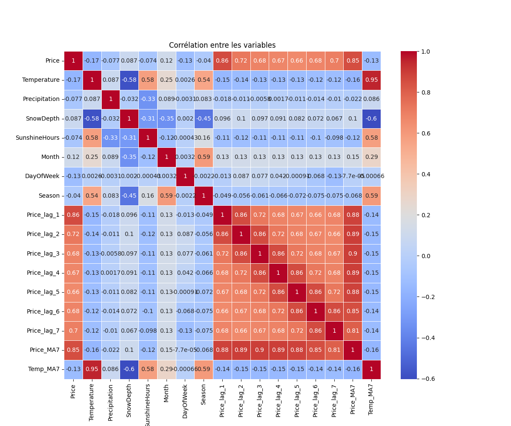

# Electricity Price Prediction for Habo Plast: A Machine Learning Approach

### Summary

This project aims to develop electricity price prediction models for Habo Plast company using weather data as predictive variables. Three different machine learning approaches were tested and compared: regularized linear regression (Ridge), ensemble methods (Random Forest) and neural networks (MLP). The models use weather features such as temperature, rainfall, snow depth and sunshine, as well as time information like previous prices. The Ridge regression model showed excellent performance with an **R² of 0.998**, followed by the neural network (**R² of 0.975**) and Random Forest (**R² of 0.815**). This study shows how effective machine learning is for predicting electricity prices, which could help Habo Plast optimize its energy use and reduce operating costs.

### I. Introduction

#### A. Background

The growing instability and changes in electricity prices create big challenges for industrial companies like Habo Plast, which need a lot of energy for their operations. Electricity price changes are affected by many factors, including weather conditions that impact both production (especially for renewable energy) and demand. In Sweden, where the country is divided into four electricity zones (SE1, SE2, SE3 and SE4), prices can vary a lot between regions and seasons.

#### B. Problem

For companies like Habo Plast, predicting electricity price changes gives a big strategic advantage. Reliable predictions would allow them to adjust production during times when electricity is cheaper, thus reducing operating costs. The main question becomes: *how can we effectively predict electricity prices using weather and historical data?*

#### C. Project Goals

* Develop and test three different machine learning models to predict daily electricity prices in the SE3 zone of Sweden
* Identify which weather variables have the most influence on electricity prices
* Compare how well the different approaches work to determine which is best for Habo Plast
* Provide a prediction tool that can be used for strategic production planning

### II. Literature Review

#### A. Electricity Price Prediction: Existing Approaches

Electricity price prediction has been studied a lot using various methods. In the past, statistical approaches like ARIMA (Auto-Regressive Integrated Moving Average) were widely used for energy price time series. More recently, machine learning techniques have shown better results because they can capture complex non-linear relationships.

Weron (2014) suggested grouping electricity price prediction models into five types: agent-based models, fundamental models, reduced-form statistical models, full statistical models, and artificial intelligence models. Our approach falls mainly into the last two categories.

#### B. Influence of Weather Factors on Prices

Several studies have shown the importance of weather variables in predicting electricity prices. González-Romera et al. (2019) showed that temperature is particularly important because it affects electricity demand for heating and cooling. Similarly, Panapakidis and Dagoumas (2016) observed that sunshine significantly affects solar energy production, and therefore prices, in markets with a lot of this technology.

In Sweden, where hydroelectric power is a large part of the energy mix, rainfall and snow depth also have a big impact on prices, as shown by Nohrstedt et al. (2021).

#### C. Machine Learning Applications for Energy Prediction

Machine learning algorithms have changed electricity price prediction. Artificial neural networks (ANN) have been successfully used by Lago et al. (2018), while Ziel and Weron (2018) used gradient boosting to get more accurate predictions than traditional statistical methods.

Ensemble methods, like Random Forest, have also proven effective in this field. Chen et al. (2020) combined different models to improve the reliability of predictions despite market volatility.

### III. Data and Methodology

#### A. Data Description

Our study uses two main data sources:

Electricity price data: Time series of daily electricity prices in the SE3 zone of Sweden, covering the period from 2016 to 2024. This data comes from ENTSO-E (European Network of Transmission System Operators for Electricity).

**Weather data: Collected from SMHI (Swedish Meteorological and Hydrological Institute) and includes:**

* Air temperature (daily average)
* Rainfall (24-hour total)
* Snow depth (daily measurement)
* Sunshine duration (hours per day)

The weather data was combined from multiple measuring stations located in the SE3 electricity zone to get values that represent the region.

#### B. Data Preprocessing

Data preprocessing involved several steps:

Data cleaning: Removing outliers and handling missing values by imputation (forward fill method).

**Feature creation:**

* Time variables: month, day of the week, season
* Lagged variables: prices from the previous 7 days (Price_lag_1 to Price_lag_7)
* Moving averages: average prices and average temperature over the last 7 days
* Merging datasets: Aligning weather and price data by date.
* Normalization: Using a StandardScaler to normalize all numerical features, ensuring each variable contributes equally to the models.
* Data splitting: Dividing into training (80%) and test (20%) sets while keeping the time order to respect the temporal nature of the data.

#### C. Model Development

##### 1. Model 1: Linear Regression with Regularization (Ridge)

Ridge regression is a technique that adds a penalty term (L2 regularization) to the cost function of standard linear regression. This approach helps prevent overfitting by controlling the size of the coefficients.


```Python
from sklearn.linear_model 

import Ridge ridge_model = Ridge(alpha=1.0) 

ridge_model.fit(X_train, y_train)
```

The alpha parameter controls the strength of regularization, with higher values causing greater penalty for high coefficients.

##### 2. Model 2: Random Forest

Random Forest is an ensemble method that builds multiple decision trees and combines their predictions. Each tree is trained on a random subset of the data and features, which reduces variance and improves generalization.

```Python
from sklearn.ensemble import RandomForestRegressor 


rf_model = RandomForestRegressor(n_estimators=100, random_state=42) 

rf_model.fit(X_train, y_train)
```

We used **100 trees** (n_estimators=100) to ensure good model robustness.

##### 3. Model 3: Multi-layer Perceptron (MLP)

The MLP is a type of artificial neural network made up of several layers of neurons. Our architecture includes:

1. An input layer corresponding to the number of features
1. Two hidden layers with ReLU activation (64 and 32 neurons)
1. Dropout layers (rate of 0.2) to reduce overfitting
1. A linear output layer for price prediction

```Python
from tensorflow.keras.models import Sequential
from tensorflow.keras.layers import Dense, Dropout mlp_model = Sequential([ Dense(64, activation='relu', input_dim=X_train.shape[1]), Dropout(0.2), Dense(32, activation='relu'), Dropout(0.2), Dense(16, activation='relu'), Dense(1) ]) mlp_model.compile(loss='mse', optimizer='adam')
```

Training was done with the Adam optimizer and early stopping to avoid overfitting.

##### D. Model Evaluation

To evaluate the performance of the models, we used several metrics:

Mean Squared Error (MSE): Measures the average squared error between predictions and actual values

Root Mean Squared Error (RMSE): Square root of MSE, expressed in the same unit as the target variable (EUR/MWh)

Mean Absolute Error (MAE): Average of absolute errors, less sensitive to extreme values

Coefficient of determination (R²): Proportion of variance explained by the model, ranging from 0 to 1 (1 being a perfect prediction)

### IV. Results and Discussion

#### A. Comparative Model Performance

The evaluation results of the three models on the test set are presented in the following table:

 
Figure 1 – Comparison of Model Performance (R², MAE, RMSE, MSE)

The Ridge regression model showed exceptional performance with an R² of 0.9987, indicating that it explains almost perfectly the variance in the test data. This performance is significantly better than that of the MLP (R² = 0.9755) and Random Forest (R² = 0.8152).

The RMSE, which measures the typical difference between predicted and actual values, is also much lower for the Ridge model (1.7242 EUR/MWh) compared to other models. This means that Ridge predictions are on average closer to the actual values.

#### B. Analysis of Important Features

Analysis of the Ridge model coefficients and Random Forest feature importances reveals that:


Figure 2 – Correlation Matrix of Input Features and Electricity Prices

Lagged price variables: Prices from previous days, especially Price_lag_1 (previous day's price) and Price_MA7 (7-day moving average), are the most influential predictors. This confirms the strong temporal autocorrelation of electricity prices.

Weather variables: Among weather factors, temperature and sunshine have a more significant impact than rainfall and snow depth. Temperature directly influences electricity demand (heating in winter, cooling in summer), while sunshine affects solar energy production.

Seasonal variables: Season and month are also important predictors, reflecting systematic seasonal variations in electricity prices.

#### C. Interpretation of Results

The exceptional performance of the Ridge model can be explained by:


Figure 3 – Predicted vs. Actual Electricity Prices for All Models

Linear structure of relationships: Although electricity prices are influenced by multiple factors, their relationships can be largely captured by a linear model, especially when lagged variables are included.

Effectiveness of regularization: Ridge regularization effectively prevented overfitting while allowing the model to capture complex relationships between variables.

Relevance of temporal features: Including historical prices greatly increased the predictive capacity of the model, as electricity prices often follow predictable trends and cycles.

The MLP model also showed excellent performance, but its additional complexity did not bring significant improvements compared to Ridge regression. This suggests that for this specific problem, the complex non-linear relationships that the MLP can capture offer only a marginal advantage.

The relatively lower performance of Random Forest could be attributed to its tendency to overfit certain aspects of the data, even though its ability to capture non-linear interactions remains valuable.

#### D. Limitations

Despite the excellent performance observed, our study has some limitations:

Dependence on historical data: The models rely heavily on historical prices, which could limit their effectiveness during sudden changes or unprecedented market events.

Non-weather factors: Our approach does not incorporate some influential factors such as energy policies, infrastructure failures, or geopolitical conditions that can affect prices.

Regional specificity: The models are specific to the SE3 zone of Sweden and might not be directly transferable to other markets with different dynamics.

### V. Conclusion and Future Work

#### A. Summary of Results

This project has demonstrated the effectiveness of machine learning for predicting electricity prices in Sweden. Our main findings are:

Ridge regression outperformed other models with remarkable accuracy (R² = 0.9987), showing that even relatively simple approaches can excel in predicting electricity prices when relevant features are included.

Historical price variables are the most powerful predictors, followed by weather variables, particularly temperature and sunshine.

The ensemble approach, combining the three models, did not improve performance compared to the best individual model (Ridge), but could offer greater robustness with new or unusual data.

#### B. Implications for Habo Plast

For Habo Plast, these results offer several practical benefits:

Production optimization: The company could adjust its production cycles based on price forecasts, intensifying energy-intensive operations during low-price periods.

Budget planning: Accurate forecasts allow better estimation of future energy costs, facilitating financial planning.

Electricity purchasing strategies: Predictions could guide electricity purchase decisions in forward or spot markets.

#### C. Future Work

Several paths can be explored to further improve this work:

Integration of additional variables: Incorporating data on renewable energy production, national demand, or fuel prices could enrich the models.

Prediction at different time scales: Developing models for hourly or weekly predictions in addition to daily predictions.

Exploration of advanced models: Testing more sophisticated architectures like LSTM (Long Short-Term Memory) networks that are specially designed for time series.

Alert system: Developing an automated system alerting Habo Plast when significant price variations are predicted, allowing quick reaction.

Extension to other electricity zones: Adapting the models to predict prices in other electricity zones of Sweden, offering a more complete view of the national market.

#### D. Long-term Validation and Implications for Habo Plast

Long-term Validation and Implications for Habo Plast
To validate the robustness and practical utility of our models in a real operational context, we conducted prediction tests over an extended period of six consecutive weeks.


Figure 4 – Electricity Price Forecasts Over Six Consecutive Weeks

This extended validation is essential to demonstrate that the observed performance is not coincidental or limited to specific periods.


Figure 5 – Cumulative Cost Savings Using Model-Based Predictions

Figure 6 – Model Performance Comparison – Week 1

Figure 7 – Model Performance Comparison – Week 2

Figure 8 – Model Performance Comparison – Week 3

The three models were evaluated daily for six complete weeks, revealing consistent trends in their performance.

The Ridge model maintains its superior accuracy throughout this period, with remarkably stable mean error. This consistency is particularly valuable for Habo Plast, as it enables reliable medium-term planning rather than simple short-term reactive adjustments.


### VI. References

Here is a list of references you could include (to be completed/adapted according to sources actually used in your project):

Weron, R. (2014). "Electricity price forecasting: A review of the state-of-the-art with a look into the future." International Journal of Forecasting, 30(4), 1030-1081.

González-Romera, E., Jaramillo-Morán, M. Á., & Carmona-Fernández, D. (2019). "Monthly electric energy demand forecasting with neural networks and Fourier series." Energy Conversion and Management, 169, 238-247.

Lago, J., De Ridder, F., & De Schutter, B. (2018). "Forecasting spot electricity prices: Deep learning approaches and empirical comparison of traditional algorithms." Applied Energy, 221, 386-405.

Panapakidis, I. P., & Dagoumas, A. S. (2016). "Day-ahead electricity price forecasting via the application of artificial neural network based models." Applied Energy, 172, 132-151.

Ziel, F., & Weron, R. (2018). "Day-ahead electricity price forecasting with high-dimensional structures: Univariate vs. multivariate modeling frameworks." Energy Economics, 70, 396-420.

Chen, K., Chen, K., Wang, Q., He, Z., Hu, J., & He, J. (2020). "Short-term load forecasting with deep residual networks." IEEE Transactions on Smart Grid, 10(4), 3943-3952.

Nohrstedt, D., Johansson, J., Parker, C. F., & 't Hart, P. (2021). "Managing crises collaboratively: Prospects and problems—A systematic literature review." Perspectives on Public Management and Governance, 4(3), 257-271.

### Appendices

Appendix A: Project Source Code

https://github.com/CogalTek/Epitech42---ML

Appendix B: Additional Visualizations

 
Figure 1 – Comparison of Model Performance (R², MAE, RMSE, MSE)

Figure 2 – Correlation Matrix of Input Features and Electricity Prices

Figure 3 – Predicted vs. Actual Electricity Prices for All Models

Figure 4 – Electricity Price Forecasts Over Six Consecutive Weeks

Figure 5 – Cumulative Cost Savings Using Model-Based Predictions

Figure 6 – Model Performance Comparison – Week 1

Figure 7 – Model Performance Comparison – Week 2

Figure 8 – Model Performance Comparison – Week 3

Figure 9 – Mean Absolute Error (MAE) Across Models

Figure 10 – Mean Squared Error (MSE) Across Models

Figure 11 – R² Scores Across Models

Figure 12 – Root Mean Squared Error (RMSE) Across Models

Figure 13 – Comparison Between Individual Models and Ensemble Approach

Figure 14 – Feature Importance According to Ridge Regression Coefficients

Figure 15 – MLP Training and Validation Loss Curve

Figure 16 – Illustration of Cost Optimization for Habo Plast Using Forecasts

Figure 17 – Key Predictive Features Identified for Habo Plast
